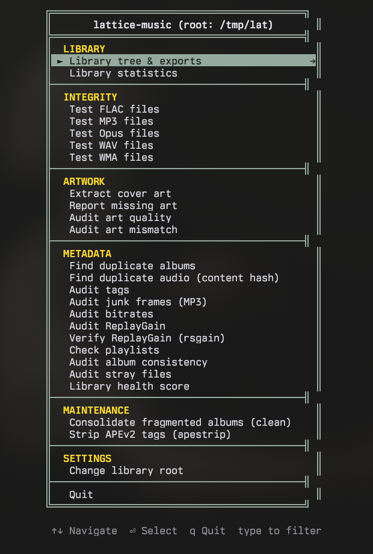

<p align="center">
  
</p>

<p align="center">
  <a href="https://www.python.org/"></a>
  <a href="LICENSE"></a>
  <a href="https://github.com/VirInvictus/lattice-music/actions/workflows/ci.yml"></a>
  <a href="https://pypi.org/project/lattice-music/"></a>
</p>

<p align="center">
  
</p>

A CLI/TUI toolkit for music collectors who manage their own libraries. lattice-music handles library visualization, integrity verification, cover art extraction, and metadata auditing, built on `mutagen` and `tqdm`, with the shared `vir-tui` library powering its terminal UI and `flac` and `ffmpeg` shelled out for integrity checks.

> **Read-only by default.** lattice-music reads tags and decodes audio, and it writes only reports, playlists, and extracted cover art. The two exceptions are the explicit write modes: `--clean` (consolidate fragmented album folders, optionally normalize names and tags) and `--apestrip` (remove stray APEv2 tags from MP3s). Both are dry-run by default, write only on `--apply`, and log every change. The optional companion scripts in `scripts/` also **do** modify files (tags, rating bytes, folder layout) and must be used with caution. See [Write modes](#write-modes) and [Companion scripts](#companion-scripts).

> **Note:** This is actively maintained software: bug fixes land as they come, and the audit-mode family keeps growing (see the Features table). It is thoroughly tested and known to be fully functional on the primary development environment: **Fedora Linux 44 (Workstation Edition)** on **Python 3.14**, with `flac` and `ffmpeg` from the Fedora repositories. While it is pure Python and should be cross-platform, this specific setup is the only officially tested environment.

## Contents

- [Why this exists](#why-this-exists)
- [Features](#features) · [Sample output](#sample-output)
- [Installation](#installation) · [Requirements](#requirements)
- [Usage](#usage)
- Modes: [Write modes](#write-modes) · [AI library export](#ai-library-export) · [Genre wings](#genre-wings) · [Multi-root scanning](#multi-root-scanning) · [Integrity checks](#integrity-checks) · [Library statistics](#library-statistics) · [Cover art extraction](#cover-art-extraction) · [Color output](#color-output) · [Supported formats](#supported-formats)
- [Architecture](#architecture)
- [Full help output](#full-help-output)
- [Companion scripts](#companion-scripts) (destructive): [`retag.py`](#retagpy) · [`genre_tidy.py`](#genre_tidypy) · [`rerate.py`](#reratepy) · [`cleaner.py`](#cleanerpy) · [`genre_foldermap.py`](#genre_foldermappy) · [`replaygain.py`](#replaygainpy) · [`apestrip.py`](#apestrippy) · [`slipcover.py`](#slipcoverpy) · [`flac2opus.py`](#flac2opuspy)
- [Credits & Acknowledgements](#credits--acknowledgements) · [Support](#support)

## Why this exists

Modern music players often hide your library behind proprietary databases. lattice-music is built for collectors who treat the filesystem as the source of truth. It reads tags directly via `mutagen`, ensuring your library is portable and player-agnostic.

## Features

| Mode | Flag | Description |
|------|------|-------------|
| **Library tree** | `--library` | Builds a formatted text tree with artist/album/track/rating/genre |
| **AI library export** | `--ai-library` | Token-efficient flat export for LLM recommendation prompts |
| **Genre wings** | `--all-wings` | Generates a separate library tree file for each genre |
| **AI wings** | `--ai-wings` | Generates separate AI-friendly flat library files per genre |
| **Smart Playlist** | `--playlist` | Generates an .m3u playlist based on a dynamic rule (e.g. `rating >= 4`) |
| **Playlist check** | `--checkPlaylists` | Verifies the library's .m3u playlists: missing #EXTM3U headers and entries whose target no longer exists |
| **Library statistics** | `--stats` | Library-wide statistics: format breakdown, bitrate, ratings, genres, top artists |
| **FLAC integrity** | `--testFLAC` | Verifies FLAC via `flac -t` (authoritative) or FFmpeg; sorts files into severity tiers |
| **MP3 integrity** | `--testMP3` | Decodes MP3 through FFmpeg (demuxer forced); sorts files into severity tiers |
| **Opus integrity** | `--testOpus` | Decodes Opus through FFmpeg; sorts files into severity tiers |
| **WAV integrity** | `--testWAV` | Decodes WAV through FFmpeg; sorts files into severity tiers |
| **WMA integrity** | `--testWMA` | Decodes WMA through FFmpeg; sorts files into severity tiers |
| **Cover art extraction** | `--extractArt` | Extracts embedded art to `cover.jpg` with format priority ranking |
| **Missing art report** | `--missingArt` | Lists directories with no cover art (folder or embedded) to text |
| **Art quality audit** | `--auditArtQuality` | Reports extracted/folder covers below a resolution threshold |
| **Art mismatch audit** | `--auditArtMismatch` | Compares embedded art against folder covers: byte-identical, same-pixels re-encodes, and real mismatches |
| **Duplicate detection** | `--duplicates` | Four-section report: exact album dupes across directories, within-folder multi-format pairs, fuzzy similar-name candidates, and track-level dupes filtered by duration |
| **Content-hash duplicate audit** | `--auditAudioDupes` | Byte-level duplicate detection: exact-file sha256, audio-stream sha256 (tags parsed out, so retagged copies match), and head/tail 64KB sampling; catches renamed and retagged dupes the tag-based report misses |
| **Tag audit** | `--auditTags` | Reports files missing title, artist, track number, or genre to text |
| **Junk frame audit** | `--auditJunkFrames` | Audits MP3 ID3v2 tags for junk: obsolete v2.3/v2.2 frames, empty text frames, and nonstandard iTunes-era frames (reported, never called junk) |
| **Album consistency audit** | `--auditAlbums` | Per-album consistency: mixed codecs in one folder, track-number gaps and duplicates, and missing or divergent year tags |
| **Bitrate audit** | `--auditBitrate` | Reports files falling below a minimum bitrate floor |
| **ReplayGain audit** | `--auditReplayGain` | Reports per-album ReplayGain coverage (missing, partial, no album gain, OK); Opus R128 gain counts as tagged |
| **ReplayGain verification** | `--verifyReplayGain` | Re-measures every album read-only with `rsgain` and reports stored gains that disagree with the fresh measurement (with a per-row clip-protection exemption). Reference-aware: R128-tagged files verify at the -23 LUFS baseline their format implies, replaygain_* files at `--target-lufs` |
| **Stray-file audit** | `--auditStrays` | Reports audio outside the layout's album depth, loose tracks, hidden-dir audio the scanners prune silently, and unrecognized non-audio files in album folders |
| **Library health score** | `--healthScore` | Per-album score out of 100 aggregating tag completeness, ReplayGain coverage, art, and the bitrate floor, with point-by-point deductions |
| **Clean (write)** | `--clean` | Consolidates fragmented album folders; opt-in `--normalize-names`/`--normalize-filenames`/`--normalize-tags` passes. Dry-run by default, `--apply` to write |
| **APEv2 strip (write)** | `--apestrip` | Removes stray APEv2 tags from MP3s (`--keep-metadata` to migrate first, `--repair-malformed` for broken tags). Dry-run by default, `--apply` to write |
| **Snapshot** | `--snapshot` | Writes a per-file library snapshot TSV (path, size, mtime, key tags, ReplayGain presence) for before/after evidence |
| **Snapshot diff** | `--diff SNAPSHOT` | Replays a snapshot against the current tree: moved, retagged, resized, added, and removed files |
| **Version** | `--version` | Prints version and exits |

Running with no arguments launches an interactive TUI: a full-screen curses interface with arrow-key navigation, color-coded section groups (Library, Integrity, Artwork, Metadata, Maintenance), and a highlighted selection cursor. Menus, parameter prompts, and pause screens all render inside styled Unicode boxes for a consistent experience. Library tree, AI export, and genre wings live in a dedicated submenu; the two write modes live under Maintenance behind yes/no confirms. Long reports open in a scrollable, pannable results pager with `/` search and `n`/`N` match jumping. Falls back to typed input if curses is unavailable.

## Sample output

```
ARTIST: Ólafur Arnalds
  ├── ALBUM: Found Songs (Neo-Classical)
      ├── SONG: 01. Ólafur Arnalds — Erla's Waltz (flac) [★★★★★ 5.0/5]
      ├── SONG: 02. Ólafur Arnalds — Raein (flac) [★★★★★ 5.0/5]
      ├── SONG: 03. Ólafur Arnalds — Romance (flac) [★★★★★ 5.0/5]
      ├── SONG: 04. Ólafur Arnalds — Allt varð hljótt (flac) [★★★★★ 5.0/5]
      ├── SONG: 05. Ólafur Arnalds — Lost Song (flac) [★★★★★ 5.0/5]
      ├── SONG: 06. Ólafur Arnalds — Faun (flac) [★★★★★ 5.0/5]
      └── SONG: 07. Ólafur Arnalds — Ljósið (flac) [★★★★★ 5.0/5]
```

Genre tags are optional (`--genres`). If your genre metadata is inconsistent, leave them off; the tree gets unwieldy fast.

## Installation

lattice-music installs as a Python package, or compiles into a standalone binary (PyInstaller, `hatch run build-bin`).

**Option 1: pipx (recommended)**
```bash
pipx install lattice-music
# now you can run `lattice` globally
```

**Option 2: pip (virtual environment)**
```bash
pip install lattice-music
```

## Requirements

Runtime dependencies are `mutagen`, `tqdm`, and `vir-tui` (installed automatically; `vir-tui` powers the interactive TUI). The integrity modes shell out to system tools:

- [`flac`](https://xiph.org/flac/): used by `--testFLAC` (preferred)
- [`ffmpeg`](https://ffmpeg.org/): used by `--testMP3`, `--testOpus`, `--testWAV`, `--testWMA`, and as a fallback for `--testFLAC`
- [`rsgain`](https://github.com/complexlogic/rsgain): used by `--verifyReplayGain` (scan-only; also used by the [`replaygain.py`](#replaygainpy) companion to write tags)

```bash
# Fedora/RHEL
sudo dnf install flac ffmpeg-free
# Debian/Ubuntu
sudo apt install flac ffmpeg
# Windows
winget install flac ffmpeg
```

**Tests.** The suite is stdlib `unittest` (no extra dependencies): pure-helper unit tests plus integration tests that run the report modes, and the companion scripts, against a committed fixture library. Run it from the repo root:

```bash
python -m unittest discover
```

## Usage

lattice-music remembers your library location. On first run (TUI or CLI) it asks for your music library path and saves it to `~/.config/lattice/config.json`; after that, `--root` is optional. Repeat `--root` to scan several libraries together in one pass (see [Multi-root scanning](#multi-root-scanning)).

```bash
# Build a library tree with genre tags
lattice --library --output library.txt --genres

# Export library for AI/LLM recommendation prompts
lattice --ai-library --output library_ai.txt

# Generate per-genre library files (add --genres to label each album)
lattice --all-wings --output wings/

# Generate per-genre AI-friendly library files
lattice --ai-wings --output wings_ai/

# Library statistics (prints to screen, or --output for file)
lattice --stats
lattice --stats --output library_stats.txt

# Verify FLAC integrity (4 parallel workers)
lattice --testFLAC --output flac_errors.txt --workers 4

# Verify MP3s for decode errors
lattice --testMP3 --output mp3_errors.txt --workers 4

# Verify Opus files for decode errors
lattice --testOpus --output opus_errors.txt --workers 4

# Extract cover art (FLAC > Opus > M4A > MP3 priority)
lattice --extractArt

# Preview art extraction without writing files
lattice --extractArt --dry-run

# Report directories missing cover art
lattice --missingArt --output missing_art.txt

# Where embedded art and the folder cover disagree (players pick silently)
lattice --auditArtMismatch --output art_mismatch.txt

# Find duplicates: exact, multi-format, similar-name, track-level
lattice --duplicates --output duplicates.txt

# Byte-level duplicate hunt: catches renamed and retagged copies
# (exact sha256, audio-stream sha256, head/tail 64KB sampling)
lattice --auditAudioDupes --output audio_dupes.txt

# Scan two libraries together (repeat --root); surfaces cross-library duplicates
lattice --duplicates --root ~/Music --root /mnt/usb/Albums --output duplicates.txt

# Score every album out of 100: tags, ReplayGain, art, bitrate
lattice --healthScore --output health_score.txt

# Audit tags for missing metadata
lattice --auditTags --output tag_audit.txt

# Find obsolete and empty ID3 frames the taggers left behind (MP3)
lattice --auditJunkFrames --output junk_frames.txt

# Per-album consistency: mixed codecs, track gaps, year divergence
lattice --auditAlbums --output album_consistency.txt

# Audit ReplayGain coverage per album (add --verbose to also list fully-tagged albums)
lattice --auditReplayGain --output replaygain_audit.txt

# Verify the stored gains themselves: re-measure read-only with rsgain
# (verify a -14-targeted library with --target-lufs -14)
lattice --verifyReplayGain --output replaygain_verify.txt

# Check the library's playlists for entries the movers have orphaned
lattice --checkPlaylists --output playlist_check.txt

# Snapshot before a maintenance pass, diff after: the full change record
lattice --snapshot --output before.tsv
lattice --clean ~/Music --apply
lattice --diff before.tsv --output changes.txt

# Audit files that don't fit the layout: strays, loose tracks, hidden-dir
# audio, and non-audio junk in album folders
lattice --auditStrays --output stray_audit.txt

# Preview the clean write mode: merge fragmented album folders (writes nothing)
lattice --clean ~/Music

# Merge for real, plus the opt-in name and tag normalization passes
lattice --clean ~/Music --apply --normalize-names --normalize-filenames --normalize-tags

# Preview the APEv2 strip, then apply it
lattice --apestrip ~/Music
lattice --apestrip ~/Music --apply
```

## Write modes

Two modes write to your library, and both are **dry-run by default**: without `--apply` they only preview, and every change is recorded to an append-only timestamped log.

- **`lattice --clean`** consolidates fragmented album folders (the same job as [`cleaner.py`](#cleanerpy)), then applies the opt-in passes you name: `--normalize-names` (rename folders at any depth), `--normalize-filenames` (rename track files), `--normalize-tags` (library-wide typographic tag normalization; on MP3s it writes ID3v2.3 plus a refreshed ID3v1), or `--all` for all three. On a genre-first library, pass `--layout '{genre}/{artist}/{album}'` so the tag pass reads the artist level correctly. The preview predicts the real run exactly; the log defaults to `<root>/cleanup.log`.
- **`lattice --apestrip`** strips stray APEv2 tags from MP3s (the same job as [`apestrip.py`](#apestrippy)). `--keep-metadata` migrates sole-source APE fields into ID3 first (genre is never migrated; ratings are reported, never written), and `--repair-malformed` also repairs malformed APE tags via verified atomic byte surgery. A real run prints the worklist and asks for confirmation (auto-skipped when stdin is not a TTY); the log defaults to `<root>/apestrip.log`.

```bash
# Preview, then merge fragmented folders and run every normalization pass
lattice --clean ~/Music
lattice --clean ~/Music --apply --all

# Preview, then strip APEv2 tags
lattice --apestrip ~/Music
lattice --apestrip ~/Music --apply --keep-metadata
```

The TUI exposes both under its Maintenance section, behind yes/no confirms (answering No to the apply question runs the preview instead). The `scripts/cleaner.py` and `scripts/apestrip.py` launchers keep their historical apply-by-default behavior for aliases and cron; see [Companion scripts](#companion-scripts).

## AI library export

The `--ai-library` mode generates a flat, pipe-delimited summary designed to fit inside an LLM context window for music recommendations:

```
Artist | Album | Genre | Rating | Tracks
--------------------------------------------------
Converge | Jane Doe | Metalcore | 4.8 | 12
Ólafur Arnalds | Found Songs | Neo-Classical | 5.0 | 7
```

**Rating** is the average across all rated tracks. **Tracks** is the number of audio files in the album directory. If you've culled 3-star-and-below tracks from disk, this is your survivor count. Paste the output into a prompt and ask for recommendations against your actual library.

## Genre wings

`--all-wings` groups albums by genre and writes one library tree file per genre into the output directory:

```bash
lattice --all-wings --root ~/Music --output wings/
```

Produces `Alternative_Rock_Library.txt`, `East_Coast_Rap_Library.txt`, and so on; untagged albums land in `Uncategorized_Library.txt`. Add `--genres` to label each album header.

## Multi-root scanning

`--root` is repeatable, so a single invocation can span more than one library:

```bash
lattice --duplicates --root ~/Music --root /mnt/usb/Albums --output duplicates.txt
```

Every mode aggregates across the roots: combined statistics, one merged library tree, genre wings that span both, and so on. A path passed twice is de-duped. The exception is the two write modes: `--clean` and `--apestrip` operate on exactly one tree and refuse a multi-root list. The payoff for `--duplicates` is cross-library detection: an album that lives in both libraries is grouped as a single exact duplicate, and each entry is prefixed by its root's basename (`Music/…` vs `Albums/…`) so you can tell the copies apart.

To make several roots permanent, add a `library_roots` array to `~/.config/lattice/config.json`:

```json
{ "library_roots": ["/home/you/Music", "/mnt/usb/Albums"] }
```

The first-run prompt still saves only the single `library_root`, so a throwaway `--root` is never written to config.

## Integrity checks

The integrity modes (`--testFLAC`, `--testMP3`, `--testOpus`, `--testWAV`, `--testWMA`) decode every file and sort the results into four tiers rather than a flat pass/fail, because a decoder complaint is not by itself proof of damaged audio:

- **CORRUPT**: could not decode through, or a FLAC truncated before its declared length.
- **SUSPECT**: decoded to the end but the tool complained (these usually still play), or a FLAC with trailing data after a complete stream.
- **METADATA**: only tag/container parse warnings; the audio is fine.
- **OK**: clean decode.

CORRUPT and SUSPECT are always listed in the report; METADATA and OK are summarized and listed only with `--verbose`. The exit code is `1` only when something is CORRUPT, so a clean-but-chatty library still exits `0`; a scan with no decoder available (ffmpeg missing, or neither flac nor ffmpeg for FLAC) refuses with exit `2` rather than report unverified files as OK. FFmpeg is invoked with the demuxer forced from the file extension (so a large ID3v2 tag is never mis-read as a corrupt container) and with embedded cover art skipped.

The FLAC and MP3 scans support `--resume` for large libraries: every run writes each verdict through to a transient `<output>.progress.json` beside the report as it goes, and a run interrupted with Ctrl-C leaves that state behind. Re-running with `--resume` reuses the recorded verdicts and decodes only the remaining files, producing the same full report either way; a scan that runs to completion deletes the state file. A state recorded by a different verification tool (libFLAC vs ffmpeg) is discarded rather than trusted.

## Library statistics

`--stats` reports file counts, total size and duration, a per-format breakdown, a bitrate summary, the rating distribution, top genres, and top artists. Prints to screen, or `--output` to save.

## Cover art extraction

`--extractArt` writes embedded art to `cover.jpg`, pulling from the highest-quality source in each directory (FLAC → Opus/OGG → M4A → MP3) and preferring the "Front Cover" picture type. It checks for existing covers case-insensitively (`cover`/`folder`/`front`/`album` in `.jpg`/`.jpeg`/`.png`), so it won't duplicate art. Reads FLAC pictures, Opus/OGG `METADATA_BLOCK_PICTURE`, M4A `covr` atoms, and MP3 `APIC` frames.

## Color output

The status summary that each integrity mode prints is colorized: green for an all-clear, yellow for suspect counts, red for corrupt counts. Color appears only on an interactive terminal. It is suppressed inside the TUI, when output is piped or redirected, and when `NO_COLOR` is set, so report files and pipes stay clean.

## Supported formats

`.mp3` · `.flac` · `.ogg` · `.opus` · `.m4a` · `.wav` · `.wma` · `.aac`

## Architecture

lattice-music is a modular Python package under `src/lattice/`:

- `tags.py`: unified abstraction layer for format-agnostic metadata extraction (returns a `TagBundle` from a single `mutagen` open).
- `norm.py`: pure name/tag normalization rules (quote/dash folding, mojibake repair, tag deduplication); zero I/O, shared by the write modes.
- `modes/`: per-mode implementation of auditing and visualization logic (library, integrity, artwork, audit, stats, playlists, plus the `clean` and `apestrip` write modes).
- `cli.py` / `tui.py`: the argparse dispatch and the full-screen curses interface; both call the same mode functions.
- `config.py`: default constants (output names, audio extensions, cover names), the tag-read worker count, and the persistent library root.
- `utils.py`: filesystem walk, progress-bar dispatch, subprocess helper, and layout parsing.

The filesystem is the source of truth: lattice-music walks the tree on every invocation and keeps no index or database.

## Full help output

<details>
<summary>Full <code>lattice --help</code></summary>

```
usage: lattice [-h] [--version] [--library | --ai-library | --all-wings | --ai-wings | --testFLAC | --testMP3 |
               --testOpus | --testWAV | --testWMA | --extractArt | --missingArt | --auditArtQuality |
               --auditArtMismatch | --duplicates | --auditAudioDupes | --auditTags | --auditJunkFrames |
               --auditAlbums | --auditBitrate | --auditReplayGain | --verifyReplayGain | --auditStrays |
               --healthScore | --playlist | --checkPlaylists | --stats | --snapshot | --diff SNAPSHOT | --clean |
               --apestrip] [--root DIR] [--output OUTPUT] [--rule RULE] [--layout LAYOUT]
               [--min-art-res MIN_ART_RES] [--min-bitrate MIN_BITRATE] [--target-lufs TARGET_LUFS]
               [--tolerance TOLERANCE] [--workers WORKERS] [--prefer {flac,ffmpeg}] [--quiet] [--genres]
               [--paths] [--dry-run] [--apply] [--normalize-names] [--normalize-filenames] [--normalize-tags]
               [--all] [--keep-metadata] [--repair-malformed] [--resume] [--only-errors | --no-only-errors]
               [--ffmpeg FFMPEG] [--verbose]
               [pos_root]

Filesystem-first music library toolkit: trees, integrity, audits, content-hash duplicate detection, health score,
write modes

positional arguments:
  pos_root              Root directory (positional fallback)

options:
  -h, --help            show this help message and exit
  --version             show program's version number and exit
  --library             Generate library tree
  --ai-library          Generate token-efficient library for AI recommendations
  --all-wings           Generate separate library files for each genre
  --ai-wings            Generate separate AI-friendly library files for each genre
  --testFLAC            Verify FLAC files
  --testMP3             Verify MP3 files
  --testOpus            Verify Opus files via FFmpeg decode
  --testWAV             Verify WAV files via FFmpeg decode
  --testWMA             Verify WMA files via FFmpeg decode
  --extractArt          Extract embedded cover art to folder
  --missingArt          Report directories missing cover art
  --auditArtQuality     Report extracted/folder covers below a resolution threshold
  --auditArtMismatch    Compare embedded art against folder covers: byte-identical, same-pixels re-encodes, and
                        real mismatches
  --duplicates          Four-section dupe report: exact albums, within-folder multi-format, similar names, track-
                        level
  --auditAudioDupes     Content-hash duplicate detection: exact sha256, audio-stream, and head/tail sampled
                        matches (catches retagged or renamed dupes)
  --auditTags           Report files with incomplete tags
  --auditJunkFrames     Audit MP3 ID3v2 tags for junk frames: obsolete v2.3 leftovers, empty text frames,
                        duplicate unique frames, and nonstandard iTunes-era frames
  --auditAlbums         Per-album consistency audit: mixed codecs, track-number gaps and duplicates, and missing
                        or divergent year tags
  --auditBitrate        Report files below a certain bitrate floor
  --auditReplayGain     Report per-album ReplayGain coverage (missing, partial, no album gain)
  --verifyReplayGain    Verify stored ReplayGain values against a fresh read-only rsgain measurement (requires
                        rsgain; nothing is written)
  --auditStrays         Report audio outside the layout's album depth, loose tracks, hidden-dir audio, and
                        unrecognized non-audio files in album folders
  --healthScore         Per-album health score aggregating tag completeness, ReplayGain coverage, art, and the
                        bitrate floor
  --playlist            Generate a smart .m3u playlist based on a rule
  --checkPlaylists      Verify the library's .m3u playlists: missing #EXTM3U headers and entries whose target no
                        longer exists
  --stats               Library-wide statistics summary
  --snapshot            Write a per-file library snapshot TSV (the --diff baseline)
  --diff SNAPSHOT       Replay a --snapshot TSV against the current tree: moved, retagged, resized, added, and
                        removed files
  --clean               Consolidate fragmented album folders; optionally normalize names and tags (write mode:
                        dry-run by default, --apply to write)
  --apestrip            Strip stray APEv2 tags from MP3s (write mode: dry-run by default, --apply to write)
  --root DIR            Root directory; repeat --root to scan several libraries together (default: read from
                        config or current dir)
  --output OUTPUT       Output path
  --rule RULE           Smart playlist rule (e.g. "rating >= 4 and genre == 'Jazz'")
  --layout LAYOUT       Directory structure pattern for extracting tags from path (default: the `layout` config
                        key, or {artist}/{album}). Use {genre}/{artist}/{album} for a genre-first library.
  --min-art-res MIN_ART_RES
                        Minimum resolution in pixels for --auditArtQuality (default: 500)
  --min-bitrate MIN_BITRATE
                        Minimum bitrate in kbps for --auditBitrate (default: 192)
  --target-lufs TARGET_LUFS
                        Assumed ReplayGain write target in LUFS for --verifyReplayGain (default: -18, the
                        ReplayGain 2.0 reference; verify a -14-targeted library at -14)
  --tolerance TOLERANCE
                        Allowed |stored - expected| in dB for --verifyReplayGain (default: 0.5)
  --workers WORKERS     Parallel workers (integrity modes)
  --prefer {flac,ffmpeg}
                        Preferred tool (FLAC mode)
  --quiet               Minimize output
  --genres              Include album genres in library tree
  --paths               Include absolute directory paths at the album level
  --dry-run             Preview changes without writing (extractArt, clean, apestrip)
  --apply               Write for real (clean, apestrip); without it these modes only preview
  --normalize-names     --clean: also rename non-duplicate folders at every depth with non-standard characters to
                        their normalized form
  --normalize-filenames
                        --clean: also rename audio track files the same way (a distinct change from --normalize-
                        names)
  --normalize-tags      --clean: library-wide typographic tag normalization (Pass 4)
  --all                 --clean: run all normalization passes (--normalize-names, --normalize-filenames,
                        --normalize-tags)
  --keep-metadata       --apestrip: before stripping, migrate APE fields not already in ID3 into the matching ID3
                        frame (genre is never migrated, ratings never written)
  --repair-malformed    --apestrip: also repair malformed APE tags mutagen cannot parse, by excising the tag
                        bytes directly (verified + atomic)
  --resume              --testFLAC / --testMP3: reuse the verdicts recorded by an interrupted run
                        (<output>.progress.json) and scan only the remaining files; finishing a scan clears the
                        state
  --only-errors, --no-only-errors
                        Write only errors/warns (MP3/Opus/WAV/WMA modes)
  --ffmpeg FFMPEG       Path to ffmpeg
  --verbose             Verbose output
```

</details>

## Companion scripts

The `scripts/` directory holds nine standalone maintenance tools. Two of them, [`cleaner.py`](#cleanerpy) and [`apestrip.py`](#apestrippy), are thin launchers over the packaged [write modes](#write-modes) (same flags, same logs, apply-by-default as they always were). The rest are **not** part of the `lattice` package and sit **outside its contract** on purpose: unlike the package's read-only modes, they **modify your files in place**, rewriting tags, rewriting rating bytes, or moving and renaming folders. Run them directly with `python3`.

**Use them with caution.** Have a backup or snapshot first, always preview with `--dry-run`, and read the log before applying. Each writes an append-only timestamped log and is idempotent, so a second run on an already-clean library is a no-op.

| Script | What it changes | Scope |
|--------|-----------------|-------|
| [`retag.py`](#retagpy) | Genre tags on one album directory | manual, per-album |
| [`genre_tidy.py`](#genre_tidypy) | Genre tags library-wide (through `retag.py`) | policy map, then apply |
| [`rerate.py`](#reratepy) | MP3 POPM rating bytes | reconcile DeaDBeeF / foobar |
| [`cleaner.py`](#cleanerpy) | Folder names and layout (moves, merges, renames); file names with `--normalize-filenames`; title/album/artist tags (all formats) with `--normalize-tags` | filesystem (opt-in names + tags) |
| [`genre_foldermap.py`](#genre_foldermappy) | Restructures the tree into Genre/Artist/Album | filesystem |
| [`replaygain.py`](#replaygainpy) | Writes ReplayGain 2.0 gain/peak tags (via `rsgain`) | album-by-album |
| [`apestrip.py`](#apestrippy) | Removes stray APEv2 tags from MP3s (`--keep-metadata` to migrate first) | recursive, MP3-only |
| [`slipcover.py`](#slipcoverpy) | Embeds folder cover images into audio files lacking embedded art (`--fetch` queries iTunes for missing covers) | recursive |
| [`flac2opus.py`](#flac2opuspy) | Converts FLAC to Opus 128k and deletes the FLAC after verifying duration | recursive, FLAC-only |

### Importing New Music (The Circuit)

When you download or import a swath of new albums (e.g. to a staging folder like `/mnt/SharedData/Music/Unfiltered`), you should run this standard "circuit" of scripts to ensure the files are transcoded, cleaned, embedded with art, and volume-normalized before moving them to your main library.

```bash
# 1. Transcode FLACs to Opus 128kbps (saves space, copies tags securely, deletes original FLAC)
./scripts/flac2opus.py /mnt/SharedData/Music/Unfiltered -y

# 2. Strip Malformed APEv2 Tags (removes hidden APEv2 tags on MP3s that confuse players)
./scripts/apestrip.py /mnt/SharedData/Music/Unfiltered -y

# 3. Clean and Normalize
# Note: You MUST pass the --normalize-names, --normalize-tags, and --normalize-filenames flags explicitly.
# Without these, cleaner.py will only consolidate fragmented album directories, leaving messy filenames and inconsistent tags untouched.
./scripts/cleaner.py /mnt/SharedData/Music/Unfiltered --normalize-names --normalize-tags --normalize-filenames

# 4. Fetch and Embed Cover Art (queries iTunes for covers missing art, and embeds folder images)
./scripts/slipcover.py /mnt/SharedData/Music/Unfiltered --fetch -y

# 5. Apply ReplayGain 2.0 (calculates volume peaks and tags the files)
./scripts/replaygain.py /mnt/SharedData/Music/Unfiltered -y
```

Once processed, you can confidently merge these albums into your main library (`/mnt/SharedData/Music`). Over time, as your library grows, you may want to periodically maintain the entire tree by running the cleaner on the root:

```bash
./scripts/cleaner.py /mnt/SharedData/Music --normalize-names --normalize-tags --normalize-filenames
```


### `retag.py`

> **Destructive: writes genre tags in place.** Always preview with `--dry-run`; pass `--log` to keep an append-only record.

A universal genre tagger designed to work directly with the `--all-wings --paths` output.

Audio metadata formats handle multiple genres entirely differently (ID3 uses null bytes or slashes, Vorbis uses multiple `GENRE=` pairs, Apple uses specific custom atoms). `retag.py` abstracts this container chaos away, allowing you to safely hard-overwrite genres on an entire album directory simultaneously.

**The Workflow:**
1. Generate your wings with paths: `lattice --all-wings --root ~/Music --output wings/ --paths`
   *(If you are using the compiled binary, replace `lattice` with `./dist/lattice`)*
2. Open a generated wing (e.g., `Uncategorized_Library.txt`) and copy the bracketed `[/path/to/album]` from an album header.
3. Preview the change first with `--dry-run` (prints `old -> new` per file, writes nothing):
   ```bash
   ./scripts/retag.py "/mnt/SharedData/Music/Kanye West/Yeezus" "Alternative Rap" "Industrial" --dry-run
   ```
4. When it looks right, drop `--dry-run` to apply it:
   ```bash
   ./scripts/retag.py "/mnt/SharedData/Music/Kanye West/Yeezus" "Alternative Rap" "Industrial"
   ```

### `genre_tidy.py`

> **Destructive on `apply`.** `build` is read-only; `apply` rewrites genre tags through `retag.py`. Preview `apply` with `--dry-run` first.

A two-phase tool for libraries whose genre tags have drifted: it builds an **artist to genre authority map**, then collapses any album that disagrees with it. It pairs lattice-music with `retag.py`: the `build` phase only reads (through lattice's scanner), and the `apply` phase does every write through `retag.py`. It imports `lattice`, so it needs the package importable: installed via `pip`/`pipx`, or run from a checkout with `PYTHONPATH=src`.

This is aimed at the messy general library, not a meticulously tagged one. Because `build` records every genre an artist already uses, `apply` does nothing until you edit the map; on a cleanly tagged library it reports everything compliant.

**The map.** `build` writes an editable tab-separated file (default `<library>/genre_map.tsv`), one line per artist listing every genre that artist is allowed to carry:

```
Artist<TAB>Genre<TAB>Second Genre<TAB>...
```

- Every genre on the line is **allowed**: albums tagged with any of them are left untouched.
- The **first** genre is the fix target: `apply` retags any of that artist's albums whose genre is *not* on the line to this first genre.
- `build` seeds the line with all the genres the artist currently uses (most-common first), so the map starts as a faithful snapshot and `apply` is a no-op. **To tidy, remove a stray genre from a line**; its albums then collapse to the first genre. Reorder the line to change which genre is the target.
- Leave only the artist (nothing after it) to skip that artist entirely.
- Multi-genre artists get a `#` comment above their line with the per-genre counts, so low-count strays worth trimming stand out (e.g. `# Eminem: 3 genres: Hardcore Hip Hop×13, Boom Bap×1, Horrorcore×1`).
- **Compilations are excluded.** An album whose album-artist is `Various Artists` (or `VA`/`Various`) gets a flagged `EXCLUDED` comment, never an enforceable row, and `apply` always skips it: a compilation collects unrelated tracks with no single canonical genre, so there is nothing to enforce.

Matching is by the **artist tag** (normalized for quote, dash, and case variants), not the folder name. lattice-music's tag layer prefers the album-artist, so a compilation is keyed under its `Various Artists` album-artist and caught by the exclusion above.

On a genre-first library (the `Genre/Artist/Album` shape `genre_foldermap.py` builds), pass `--layout '{genre}/{artist}/{album}'` to both subcommands so an *untagged* file's artist is recovered from the right path level instead of the genre folder; tagged files are unaffected.

**Safety.** Seeding the map from the library's current state means `apply` changes nothing you have not asked for: a retag happens only where you removed a genre from a line. `apply` is otherwise guarded like the other companions: `--dry-run` previews every `retag.py` call and writes nothing (log lines prefixed `[DRY]`), an append-only timestamped log records every decision (default `<library>/genre_tidy.log`), and the operation is idempotent (a second `apply` is all no-ops). Re-running `build` over an existing map preserves your edits and only appends artists new to the library.

**The Workflow:**
1. Build the map (read-only):
   ```bash
   ./scripts/genre_tidy.py build /mnt/SharedData/Music
   ```
2. Open `genre_map.tsv`. Each line lists an artist's current genres; remove the strays you consider mistakes (the `#`-commented lines with low counts are the usual suspects), reorder to change a fix target, or blank a line to leave an artist alone.
3. Preview the changes (writes nothing):
   ```bash
   ./scripts/genre_tidy.py apply /mnt/SharedData/Music --dry-run
   ```
4. Inspect `genre_tidy.log`; every retag it would perform is recorded with `[DRY]`.
5. Apply for real:
   ```bash
   ./scripts/genre_tidy.py apply /mnt/SharedData/Music
   ```

**Relationship to `retag.py`.** `retag.py` is the manual, one-album tool; `genre_tidy.py` is the library-wide policy layer on top of it, calling it once per album you have tidied out of compliance. Reach for `retag.py` for a one-off fix, `genre_tidy.py` to enforce a whole-collection rule.

A real, `build`-generated map from a roughly 877-artist library ships at [`artist_genre_defaults.tsv`](artist_genre_defaults.tsv) in the repo root. It doubles as a worked example of the format (single- and multi-genre lines, the `#`-flagged counts, the blank-to-skip pattern) and as a maintained authority: point the tool at it with `--map artist_genre_defaults.tsv`. Keep it current by re-running `build`, which appends artists new to the library under a dated marker while preserving every line you have edited; hand-edit a line to accept a new genre for an existing artist.

### `rerate.py`

> **Destructive: rewrites MP3 rating bytes in place.** Preview with `--dry-run`; every change is logged, so a run is reversible.

Reconciles MP3 star ratings between DeaDBeeF and foobar2000. Both store ratings in an ID3 POPM frame (a 0–255 byte), but on different scales, so a rating set in one reads shifted in the other. Measured on a real library:

- DeaDBeeF 2★ writes byte `127`, which foobar reads as **3★**.
- DeaDBeeF 4★ writes byte `254`, which foobar reads as **5★**.

foobar's own values are read the same by both players (byte `196` shows 4★ in DeaDBeeF and foobar alike). So `rerate.py` rewrites DeaDBeeF's odd bytes to the equivalent foobar value, making the two agree without changing what DeaDBeeF shows: `127 → 64` (both 2★) and `254 → 196` (both 4★).

It touches only those exact bytes. foobar's canonical values, MusicBee's bytes (`186`/`242`, which already read correctly), unrated files, and every non-MP3 file are left alone; Vorbis/Opus ratings are clean 0–5 integers and are unaffected. It writes an append-only timestamped log (default `<directory>/rerate.log`) recording every `old -> new` change, so a run is fully auditable and reversible. Idempotent.

**The Workflow:**
1. Preview:
   ```bash
   ./scripts/rerate.py /mnt/SharedData/Music --dry-run
   ```
2. Inspect `rerate.log` (each change is logged as `<file>: 254 -> 196`).
3. Apply:
   ```bash
   ./scripts/rerate.py /mnt/SharedData/Music
   ```

**Scope.** `rerate.py` is MP3/POPM-only and remaps a fixed set of byte values (`REMAP` in the script). The diagnosis behind it is simply "which byte does each player read as which star"; if your players use a different scale, edit that map.

### `cleaner.py`

> **Destructive: moves, merges, and renames folders.** Preview with `--dry-run` and read the log before applying.

> **Launcher note.** Since 5.0.0 the consolidation and normalization engine lives in the package (`lattice --clean`); `scripts/cleaner.py` is a thin launcher over it, kept for aliases and cron with the same flags, the same `<directory>/cleanup.log`, and its historical apply-by-default contract. Everything below describes both entry points; only the default (apply here, dry-run in the package) differs.

A one-shot consolidator for **album folders that have fragmented across two paths because of inconsistent metadata**. The pattern looks like this:

```
Music/Modern Baseball/You're Gonna Miss It All/   ← 3 mp3s (straight quote)
Music/Modern Baseball/You’re Gonna Miss It All/   ← 3 opus (curly quote)
```

Same album, no track overlap, scattered between two folders by filesystem accident. The same artifact shows up at the artist level (`Jay-Z & Kanye West/` vs `JAY‐Z & Kanye West/`, different hyphen codepoints) and across casing variants (`BONES/` vs `Bones/`).

`cleaner.py` walks the library, finds every sibling pair of folders whose names normalize to the same key (after folding curly→straight quotes, en/em-dashes→ASCII hyphen, NFKC, lowercase, strip), and merges the smaller into the larger.

**Safety contract.**
- **`mv` only** on the same filesystem: an atomic rename, so audio bytes are never read or rewritten.
- **Audio collisions never auto-delete.** If a track of the same name exists in both folders, the source copy is kept under a `<stem>.from-fragment.<ext>` suffix instead of being overwritten. A copy is dropped as a true duplicate only when both the byte count *and* sampled content (first/last 64 KiB) match; a same-size file with differing bytes is kept as a fragment too.
- **Cover-art collisions keep the better image.** When a `.jpg`/`.png` exists in both folders, the higher-resolution file wins (ties, or images it cannot parse, fall back to the larger byte size). Other non-audio collisions (`.nfo`, `.cue`) drop the source; the canonical copy wins.
- **The survivor is normalized.** The folder with the most files becomes canonical, so its name can be the less-standard variant; after merging, the survivor is renamed to its normalized form (broken hyphens, curly quotes/apostrophes folded to ASCII; en/em dashes, the ellipsis glyph, and prime marks preserved so names stay legal on NTFS/exFAT).
- **Conservative matching.** Only sibling folders whose normalized names match are merged. Cases like `Domestica` vs `Cursive's Domestica (Deluxe Edition)` (different prefix, not just quote variation) are left alone for manual review.
- **`--dry-run` flag** previews every action without touching the filesystem (log lines prefixed `[DRY]`) and faithfully predicts the real run, including which folders get removed.
- **Per-file logging** to `<directory>/cleanup.log` (or `--log` override): every move, drop, collision, rename, and `rmdir` is timestamped and audit-trailed.
- **Idempotent**: running on an already-clean library is a no-op.

**The Workflow:**
1. Preview first:
   ```bash
   ./scripts/cleaner.py /mnt/SharedData/Music --dry-run
   ```
2. Inspect `/mnt/SharedData/Music/cleanup.log`; every action it would take is recorded with `[DRY]` prefixes.
3. If the plan looks right, apply for real:
   ```bash
   ./scripts/cleaner.py /mnt/SharedData/Music
   ```
4. Re-run `lattice --duplicates` afterward to confirm the consolidated state.

**The passes.** Pass 1 collapses artist-folder duplicates (e.g., merges `JAY‐Z & Kanye West/` into `Jay-Z & Kanye West/`). Pass 2 then runs album-level consolidation inside each artist folder; collapsing the artist split first means album-level matching can find pairs that would otherwise be hidden under the duplicate artist directory. Pass 3 (`--normalize-names` / `--normalize-filenames`) renames folders and/or files, and Pass 4 (`--normalize-tags`) normalizes tags; both are opt-in and described below.

**Layout note.** The *merge* passes (1-2) are depth-fixed: the given root's children are treated as artists, and their children as albums. On a genre-first library (`Genre/Artist/Album`, the shape `genre_foldermap.py` builds), a variant artist split is caught one level down (as an album-level group within each genre); merging at the album-folder level there is not reached, so point `cleaner.py` at a genre folder if you need album-level merges. The Pass-3 name sweep, by contrast, recurses to every depth, and Pass 4 reads the artist level from `--layout`.

**Normalizing folder and file names (`--normalize-names`, `--normalize-filenames`).** The merge passes only touch *duplicate* folders. Libraries often also carry lone, non-duplicate folders (and track files) whose names use non-standard characters (e.g. `At the Drive‐In` with a unicode hyphen, or a curly apostrophe). With `--normalize-names`, Pass 3 renames every folder at **any depth** whose name differs from its normalized form, folding the same classes as the survivor rename (broken hyphens, curly quotes/apostrophes; en/em dashes and the ellipsis preserved so names stay legal on NTFS). `--normalize-filenames` does the same for audio **track files** (the extension is kept verbatim). They are independent: renaming files is a distinct change (filenames are referenced by playlists and cue sheets), so it is its own opt-in rather than folded into `--normalize-names`. Both are off by default and can touch many names at once, so preview with `--dry-run` first.

**Normalizing tags (`--normalize-tags`).** Pass 4 is a **library-wide** typographic pass over every audio file (`.mp3/.flac/.ogg/.opus/.m4a/.mp4/.wma`; other formats are reported and skipped):

- **Title and album** get a pure typographic fold and **duplicate deduplication**. Tags displaying as `A / A` or `A, A` (often remnants of flattened multi-value tags) are merged down to the unique value. Substrings are also resolved (e.g. `Title (feat. Artist) / Title` becomes `Title (feat. Artist)`). Afterwards, CP1252 mojibake (`Doesn\x92t` from a torrent rip), curly quotes, and broken hyphens become their clean form, while correct typography is preserved (`Selected Ambient Works 85–92` keeps its en dash, an ellipsis stays an ellipsis). The words are never changed, so the folder/filename is never used as an authority for them.
- **Artist and albumartist** use a **global tag authority**: the script builds a map of every artist-level folder across the entire library. If a track's base artist tag (ignoring guest credits like `... feat. X`) normalizes to match one of these canonical folder names, the tag is restamped to match the folder's exact casing and punctuation (e.g., unifying `El-p` and `El‐P` into the canonical `El-P` globally, even if the files live in separate genre or unsorted folders). Otherwise, they receive a pure typographic fold.

Writes are per-container (ID3 saved as ID3v2.3 + refreshed ID3v1, matching `retag.py`; Vorbis/MP4/ASF in their native fields), only changed fields are touched, and an already-clean file is a no-op (so the pass is idempotent). Two players read APEv2 over ID3, so if a stray APE tag is in play, run [`apestrip.py`](#apestrippy) first. Off by default; preview with `--dry-run`.

The artist *level* (for the authority restamp) is read from `--layout` (default `{artist}/{album}`); a genre or album folder is never mistaken for an artist. On a genre-first library pass `--layout '{genre}/{artist}/{album}'`:

```bash
./scripts/cleaner.py /mnt/SharedData/Music --dry-run \
    --normalize-names --normalize-filenames --normalize-tags \
    --layout '{genre}/{artist}/{album}'
```

**What it does not do.** `cleaner.py` is intentionally narrow. It does not:
- Touch tags or filenames **by default** (folder operations only; opt into the name/tag passes explicitly, or use `retag.py` for genre)
- Re-encode or transcode audio (filesystem operations only)
- Match albums by tag content for *merging* (folders are merged by name only, by design, so the merge is auditable from the log alone; `--normalize-tags` reads tags but only to rewrite them, never to decide a merge)
- Use the folder or filename as an authority for **title or album** tags (those are typographic-fold-only; only artist/albumartist follow the folder)
- Touch the source-of-truth import pipeline. If the same fragmentation pattern keeps reappearing, the upstream tagger or downloader needs a curly-quote normalization rule.

### `genre_foldermap.py`

> **Destructive: moves folders.** Dry-run is the **default**; nothing moves until you pass `--apply`. Every move is recorded to a manifest that `--revert` replays in reverse.

> **Tidy your genre tags first.** Placement uses each album's *dominant* genre, so an album whose tracks disagree on genre lands under whichever value wins the count, and the rest are not reflected in the tree. For predictable results, run strict tag hygiene before this script: a single, consistent genre per album is ideal. [`genre_tidy.py`](#genre_tidypy) is built for exactly that (enforce one canonical genre per artist/album), so a sensible order is `genre_tidy.py` first, then `genre_foldermap.py`.

Restructures a flat `Artist/Album/Song` library into `Genre/Artist/Album/Song`, moving each album folder under a top-level genre directory. The genre is the album's dominant embedded genre tag, read through lattice-music's scanner (the same aggregation every library/wing mode uses), so placement matches what lattice-music reports. Folder names are preserved verbatim; nothing is retagged. It imports `lattice`, so it needs the package importable: installed via `pip`/`pipx`, or run from a checkout with `PYTHONPATH=src`.

Two directory shapes are handled:
- `Artist/Album` → `Genre/Artist/Album` (the whole album directory is moved).
- An artist folder with **loose tracks** sitting directly inside (no album subfolder) → `Genre/Artist/Singles/`. Only the loose files move; any album subfolders are separate albums placed under their own genre.

Artist-level sidecar files (e.g. an `Artist/cover.jpg` beside the album subfolders) follow the artist to its dominant genre, so they are never orphaned in an emptied folder.

**Staging inbox.** A top-level folder named `Unfiltered` (override with `--staging NAME`, disable with `--staging ""`) is treated as a transparent inbox: its leading component is stripped before classification, so `Unfiltered/Artist/Album` is filed into the real taxonomy at the library root exactly like a flat `Artist/Album` stray, rather than being mistaken for a genre called "Unfiltered". This is for the case where a tagger such as MusicBrainz Picard dumps fresh `Artist` folders somewhere out of the organized root: stage them in `Unfiltered/`, tag their genres (with [`retag.py`](#retagpy)), then run this tool against the library root to file them. The albums' per-artist folders are pruned once emptied; the `Unfiltered/` inbox itself is left in place for next time.

**Placement is gated by the genres your library already uses.** The tool first learns your genre vocabulary from the folders that already hold a `Genre/Artist/Album` tree, then only files a stray into one of those existing genres. An album tagged with a genre the library doesn't already use is **flagged, not given a brand-new top-level folder** (so a typo'd or junk tag can't spawn a stray genre directory). Pass `--allow-new-genre` to lift the gate and create new folders. On a flat library with no genre folders yet, the vocabulary is empty and the gate is off, so tags are trusted; this is the normal first-time `Artist/Album` → `Genre/Artist/Album` conversion.

Albums already at `Genre/Artist/Album` are left in place. If such an album's folder genre disagrees with its tags, that is reported as a `NOTE` for your review and the album is **not** silently re-filed. Pass `--refile-mismatched` to move those albums to their tag's genre folder instead; this is the intended follow-up to a retag pass ([`retag.py`](#retagpy) / [`genre_tidy.py`](#genre_tidypy)): correct the tags first, then re-file the folders to match. Re-filing honors the same rules as filing a stray: the vocabulary gate (unknown target genres are flagged, not created, without `--allow-new-genre`), existing-folder spelling reuse, the never-overwrite rule, manifest logging (so `--revert` restores the old layout), and pruning of emptied source artist folders (a genre folder emptied of its last artist is pruned too; the library root and the staging inbox never are), with artist-level sidecars following the artist.

A tag value that joins several genres into one string with `;` or `/` never becomes a folder name: the first genre places the album and the remainder is flagged as a `MULTI-GENRE TAG` issue so the tag itself can be fixed at the source.

**Safety contract.**
- **`mv` only** on the same filesystem: an atomic rename, so audio bytes (and embedded tags/ratings) are never read or rewritten.
- **Dry-run by default.** Without `--apply` the tool only prints the plan; `--apply` performs it and writes the manifest.
- **Reversible.** Every move is appended to a manifest TSV (`src<TAB>dst<TAB>time`); `genre_foldermap.py --revert <manifest> --apply` undoes the run (like a forward run, `--revert` alone is a dry-run preview). Files and moved folders are restored; source folders pruned empty are not recreated.
- **Never overwrites.** A destination that already exists is reported and skipped; collisions are flagged before anything moves.
- **Wrong-root guard.** A directory deeper than `Genre/Artist/Album` is flagged `TOO DEEP` and skipped, never collapsed to its last two components. Aim the tool at the parent of an already-organized library by mistake and it flags everything rather than relocating the whole tree. (Point it at the library root itself, e.g. `…/Music`, not its parent.)
- **Genre names are folded** to a filesystem-legal form (Windows/NTFS-forbidden characters become spaces), so a stray `:` or `/` in a tag can't break the tree.
- **Idempotent**: running on an already-organized library is a no-op.

**The Workflow:**
1. Preview the full plan (writes nothing):
   ```bash
   ./scripts/genre_foldermap.py /mnt/SharedData/Music
   ```
2. Smoke-test one genre, verify it landed, then do the rest:
   ```bash
   ./scripts/genre_foldermap.py /mnt/SharedData/Music --only-genre "Comedy Rock" --apply
   ./scripts/genre_foldermap.py /mnt/SharedData/Music --apply --log ~/foldermap.manifest.tsv
   ```
3. If you change your mind, replay the manifest in reverse:
   ```bash
   ./scripts/genre_foldermap.py --revert ~/foldermap.manifest.tsv --apply
   ```
4. Point lattice-music at the new shape by setting `"layout": "{genre}/{artist}/{album}"` in `~/.config/lattice/config.json` (or pass `--layout`), then regenerate your wings.

### `replaygain.py`

> **Destructive: writes ReplayGain tags in place.** Preview with `--dry-run`; a real run prints the worklist and asks for confirmation before writing (skip with `--yes`). Every album scanned, and the exact values written, are logged.

The companion to the [`--auditReplayGain`](#features) audit: where the audit *reports* which albums lack ReplayGain, `replaygain.py` *writes* it. It wraps [`rsgain`](https://github.com/complexlogic/rsgain) (libebur128, ReplayGain 2.0, the `-18 LUFS` / `89 dB` reference foobar2000 uses) to do what foobar's "Scan selection as album" does: compute one album gain plus album peak per album folder and a per-track gain plus peak, then write them into the files. rsgain leaves the audio stream untouched; only metadata changes. It imports `lattice` for the format-aware ReplayGain reader, so it needs the package importable (installed via `pip`/`pipx`, or run from a checkout with `PYTHONPATH=src`).

**Requires `rsgain`.** It is not bundled. On Fedora: `sudo dnf install rsgain`. Other platforms: see the [rsgain releases](https://github.com/complexlogic/rsgain/releases).

**Cross-platform.** The script is pure, portable Python (paths via `os.path`, no shell invocation, UTF-8 logging) and runs on Linux, macOS, and Windows. It needs the same three things everywhere: Python 3.14+ (it imports `lattice`), `mutagen`, and `rsgain` on `PATH` (macOS: `brew install rsgain`; Windows: `winget install rsgain`, scoop, or choco). One Windows-only edge: `--target-lufs` passes each track's path to rsgain as an argument, so an unusually large folder (hundreds of files) could exceed Windows' ~32K command-line limit; a normal album is nowhere near it, and the default mode (no `--target-lufs`) is unaffected because it passes only the folder.

**Safety contract.**
- **Album = one folder.** The whole folder is rescanned together so album gain is correct.
- **No half-scanned albums.** A partial album is rescanned in full; `--skip-tagged` skips an already-fully-tagged album *as a unit* (skipping only its tagged tracks would compute album gain over a subset and corrupt it).
- **`--dry-run`** lists every album and its current coverage without invoking rsgain at all.
- **Confirmation before writing.** A real run shows the worklist and prompts, unless `--yes` is passed or stdin is not a TTY.
- **Read-back logging.** After each album, the tags just written are read back and logged, so the log is a record of exactly what landed on disk.
- **Format-aware** through rsgain: MP3 (`TXXX`), FLAC/Ogg (Vorbis), Opus (the `R128_*_GAIN` convention), M4A, WMA, WAV.

**The Workflow:**
1. See what is missing (read-only, from the package):
   ```bash
   lattice --auditReplayGain --root /mnt/SharedData/Music --output rg_audit.txt
   ```
2. Preview the scan plan (writes nothing):
   ```bash
   ./scripts/replaygain.py /mnt/SharedData/Music --dry-run
   ```
3. Apply, skipping already-tagged albums and giving rsgain 4 scan threads per album:
   ```bash
   ./scripts/replaygain.py /mnt/SharedData/Music --skip-tagged --threads 4
   ```

**Going louder than the standard (`--target-lufs`).** The default target is the 89 dB / -18 LUFS ReplayGain 2.0 reference, which most players (and the rest of your library) assume. If you want a louder result, `--target-lufs N` sets a different target loudness in LUFS; each 1 LUFS is 1 dB, so a higher target attenuates loud masters less:

| Target | ≈ dB | vs 89 dB |
|---|---|---|
| `-18` | 89 dB | standard (default) |
| `-16` | 91 dB | +2 dB, gentle |
| `-14` | 93 dB | +4 dB, streaming-loud (Spotify/YouTube range) |

```bash
./scripts/replaygain.py /mnt/SharedData/Music --target-lufs -14
```

This switches rsgain to custom mode and writes standard `replaygain_*` tags for every format, Opus included (the `R128` convention is fixed at -23 LUFS and cannot carry a custom target, so it is not used here). Two caveats: keep **one** target across the whole library or albums will not be evenly normalized, and a louder target gives some tracks positive gain (clip protection stays on, but there is less headroom). For a louder result on one device only (e.g. weak laptop speakers), prefer your player's ReplayGain **pre-amp** instead: it is non-destructive, per-device, and leaves the portable 89 dB tags intact.

### `apestrip.py`

> **Destructive: removes APEv2 tags from MP3s in place.** Always preview with `--dry-run`; a confirmation prompt guards the real run, and a `--log` is written by default.

> **Launcher note.** Since 5.0.0 the strip engine lives in the package (`lattice --apestrip`); `scripts/apestrip.py` is a thin launcher over it, kept for aliases and cron with the same flags, the same `<directory>/apestrip.log`, and its historical apply-by-default contract. Everything below describes both entry points; only the default (apply here, dry-run in the package) differs.

Some MP3s (commonly torrent rips) carry a hidden **APEv2 tag** in addition to their ID3 tags. Players that read APEv2 on MP3, including foobar2000 and DeaDBeeF, merge the APE values over the ID3 ones. So a stray APE `Genre` like `Trash Metal` keeps reappearing as `Trash Metal, Metal` no matter how many times you fix the ID3 genre, and ordinary tag editors never touch the APEv2 block, so it looks unkillable. `retag.py` removes APEv2 only as a side effect of rewriting the genre; `apestrip.py` is the general stripper.

**By default it just deletes the APEv2 block and leaves ID3 untouched.** That is the point: the stray APE values (the genre most of all) are what you want gone, so copying them back into ID3 would defeat the tool. APE `Genre` and `Rating` are always **reported** so you can see exactly what is being dropped.

**`--keep-metadata` opts in to migration.** With that flag, before deleting the APEv2 tag, every APE field whose value is *not already present in ID3* is copied into the correct ID3 frame:

| APE field | Migrates to |
|---|---|
| `Year` / `Date` | `TDRC` |
| `Title` / `Artist` / `Album` | `TIT2` / `TPE1` / `TALB` |
| `Album Artist` / `Band` | `TPE2` |
| `Track` / `Disc` | `TRCK` / `TPOS` |
| `Composer` / `Publisher` | `TCOM` / `TPUB` |
| `Comment` | `COMM` |
| `Cover Art (Front)` | `APIC` (front) |
| `Unsynced lyrics` | `USLT` |
| sort orders | `TSOP` / `TSO2` / `TSOT` / `TSOA` |
| anything else (MusicBrainz IDs, ISRC, barcode, ReplayGain, ...) | `TXXX:<key>` passthrough |

Two fields are handled deliberately, never migrated even under `--keep-metadata`:

- **Genre is never migrated.** ID3 stays authoritative; the APE genre is exactly the value you want gone. If a file has no ID3 genre at all, it is reported (left blank), never invented from the APE value.
- **Rating is never written.** APE and ID3 (`POPM`) use different rating scales, so an auto-conversion would corrupt star counts (the same hazard [`rerate.py`](#reratepy) exists to fix). Any APE `Rating` is reported so you can apply it deliberately.

**The Workflow:**
1. Preview the whole library first (writes nothing):
   ```bash
   ./scripts/apestrip.py "/mnt/SharedData/Music" --dry-run
   ```
   The worklist shows, per file, whether it is a plain strip or (under `--keep-metadata`) which APE fields are redundant and which will be migrated and to where, plus any reported ratings and genre warnings.
2. When it looks right, drop `--dry-run` and confirm at the prompt:
   ```bash
   ./scripts/apestrip.py "/mnt/SharedData/Music"
   ```

A plain strip leaves the ID3 frames byte for byte; only the APEv2 block is removed. When `--keep-metadata` actually migrates a field, the ID3 is re-saved as ID3v2.3 with a refreshed ID3v1 (the same player-compatible save `retag.py` uses). The run writes an append-only timestamped log (default `<directory>/apestrip.log`) and is idempotent: a file with no APEv2 tag is left untouched, so a second run on a clean library is a no-op. MP3-only, since the APEv2-over-ID3 conflict is specific to MP3; other formats carry their own authoritative tags and are skipped. Pass `--yes` to skip the prompt (it is auto-skipped when stdin is not a TTY).

**Malformed tags (`--repair-malformed`).** Some rips carry an APEv2 tag that is structurally broken (for example a footer with the `IS_HEADER` bit wrongly set, or junk bytes between the footer and a trailing ID3v1). `mutagen` refuses to load these, so the normal path cannot strip them. By default apestrip **reports** such files (`malformed APEv2 tag (mutagen cannot parse)`) and leaves them alone rather than silently calling them clean. Pass `--repair-malformed` to fix them: apestrip parses the tag straight from the bytes, **but only after proving the footer sits exactly where the header's size field points** (so the cut boundary is a real tag edge, not a chance signature in the audio), then excises the APE block (migrating sole-source fields into ID3 first only if `--keep-metadata` is also given; genre still never migrated, ratings still report-only). The result is written to a temp file, verified (it still decodes and no APE signature survives), and atomically swapped in. The audio frames and the trailing ID3v1 are preserved byte for byte; if any check fails the original is left untouched.

### `slipcover.py`

Embeds folder cover art into audio files that are missing embedded art. The mutating companion to `--missingArt`.

When downloading or importing music, you often end up with a high-quality `cover.jpg` sitting alongside the audio files, but the files themselves have no embedded artwork. `slipcover.py` walks your library, finds directories that have a folder image (`cover.jpg`, `cover.png`, etc.) but contain audio files lacking embedded art, and writes the image directly into those files. If an album is completely missing art (no folder image and no embedded art), you can use `--fetch` to query the iTunes API and download a high-resolution cover automatically. You can also use `--report` to find these completely artless albums.

```bash
# Preview what would be embedded
./scripts/slipcover.py /path/to/library --dry-run

# Fetch missing covers from iTunes API and save as cover.jpg
./scripts/slipcover.py /path/to/library --fetch

# Report directories completely missing cover art
./scripts/slipcover.py /path/to/library --report


# Embed the images, prompting before writing
./scripts/slipcover.py /path/to/library
```

Format support matches `--extractArt`: MP3 (ID3 APIC), FLAC, Opus/OGG (Vorbis `METADATA_BLOCK_PICTURE`), and M4A (`covr` atom). The script is idempotent: files that already have embedded art are skipped, so you can run it safely across your entire library to patch up the stragglers. Writes an append-only timestamped log (`<directory>/slipcover.log`). Pass `--yes` to bypass the confirmation prompt.

### `flac2opus.py`

Converts FLAC files to Opus, verifying metadata and quality, then deletes the original FLAC.

```bash
# Preview the conversions
./scripts/flac2opus.py /path/to/library --dry-run

# Convert FLAC to Opus at 128kbps and delete the FLAC files
./scripts/flac2opus.py /path/to/library

# Convert at a different bitrate (e.g., 192kbps)
./scripts/flac2opus.py /path/to/library --bitrate 192
```

The script uses `ffmpeg` to encode the Opus file. It is designed to be highly reliable: before deleting the original FLAC, it uses `mutagen` to compare the duration of the new Opus file with the source to guarantee encoding succeeded without truncation. It also uses `mutagen` to copy the Vorbis comments and embedded cover art directly from the FLAC, bypassing ffmpeg's metadata mapping entirely to guarantee a bit-perfect preservation of tags. Requires `ffmpeg` installed in your PATH.


## Credits & Acknowledgements

lattice-music is built upon several excellent open-source libraries and tools:

- **[Mutagen](https://github.com/quodlibet/mutagen)**: Handles all audio metadata extraction and tagging logic.
- **[tqdm](https://github.com/tqdm/tqdm)**: Powers the extensible progress bars for library scanning and integrity checks.
- **[vir-tui](https://github.com/VirInvictus/vir-tui)**: The shared terminal-UI toolkit behind the interactive mode (menus, prompts, progress boxes, pager).
- **[FFmpeg](https://ffmpeg.org/)**: The heavy lifter for multi-format audio decoding and integrity verification.
- **[FLAC](https://xiph.org/flac/)**: Used for high-speed native FLAC verification.

## Support

If lattice-music's useful to you and you'd like to chip in:

- liberapay · [liberapay.com/bdkl](https://liberapay.com/bdkl/)
- bitcoin
  ```
  bc1qkge6zr45tzqfwfmvma2ylumt6mg7wlwmhr05yv
  ```
